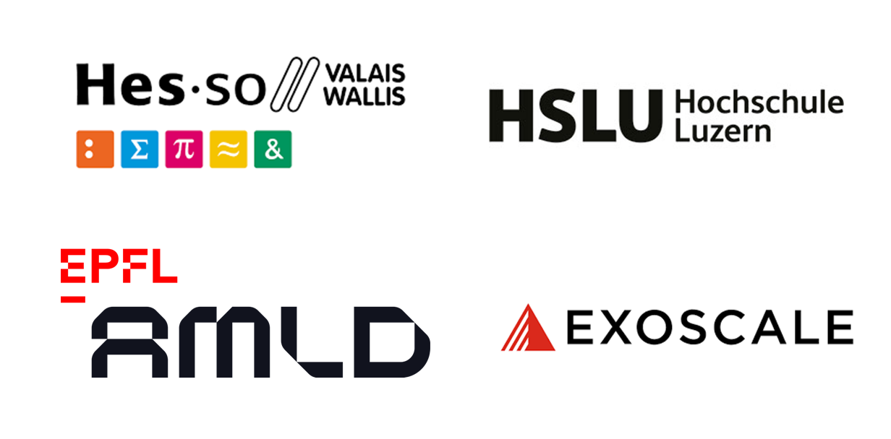

# Welcome! 
Thank you for choosing to attend (part of) our workshop _Building On-Prem LLM Applications for the Real World._ This website is the backbone of the course, and will provide you with instructions for each of the components. This workshop consists of two parts, where the first one is given in the morning and the second part in the afternoon. We hope you enjoy the workshop and learn plenty!

Alexander Sternfeld, Dr. Elena Nazarenko, Prof. Dr. Aygul Zagidullina, Gaetan Stein, Adrien O'Hana and Zach Schillaci

## Agenda

### Part 1: My First LLM App, Intro to RAG
* 09.00 - 09.35: AI Today: The Generative Landscape
* 09.35 - 10.30: [Serving a LLM On-Prem: Open WebUI](setup/index.md)
* 10.30 - 11.00: Break
* 11.00 - 11.50: [RAG - Knowledge bases and Linking a SQL Database](RAG/knowledge_base.md)
* 11.50 - 12.20: [How agents talk to tools: Towards MCP](MCP/index.md)
* 12.20 - 12.30: Closing Remarks

### Part 2: Guardrails, RAG and Threat Modelling
* 14.00 - 15.15: [Augmenting LLM Capabilities](functions/index.md)
* 15.15 - 15.30: [Prompt Injection](prompt_injection.md)
* 15.30 - 16.00: Break
* 16.00 - 16.45: [Guardrails Selection and Implementation](prompt_injection.md)
* 16.45 - 17.15: Threat modeling and basics of MLOps for LLM security
* 17.15 - 17.30: Closing remarks

